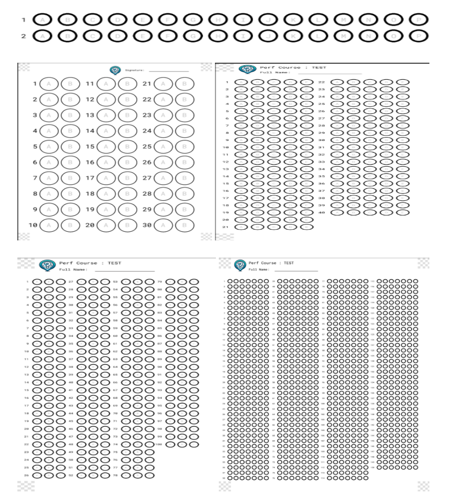
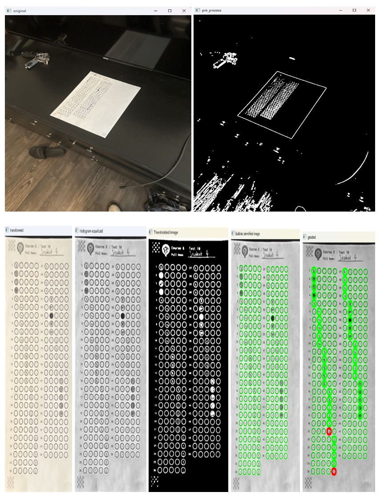
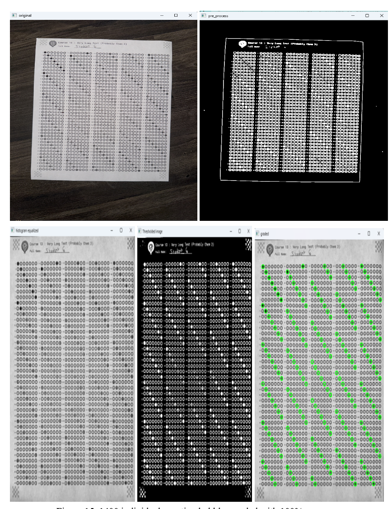
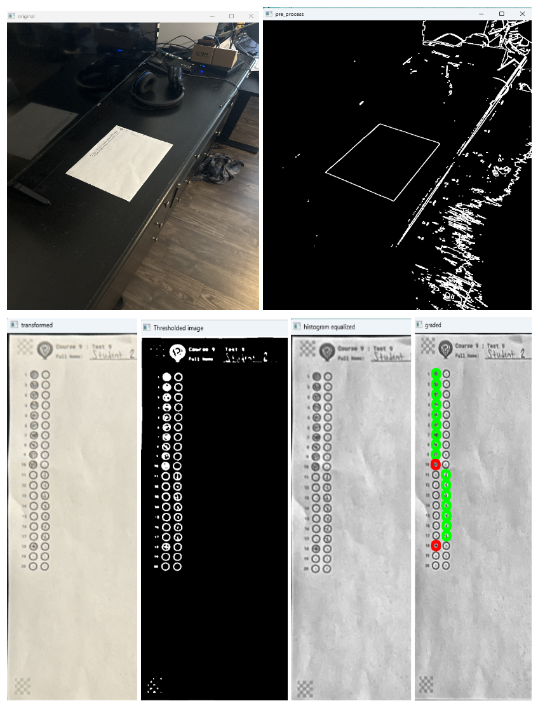
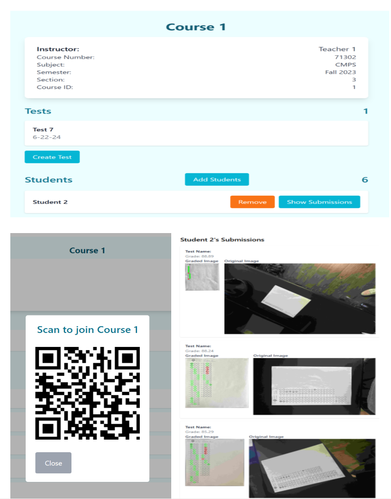
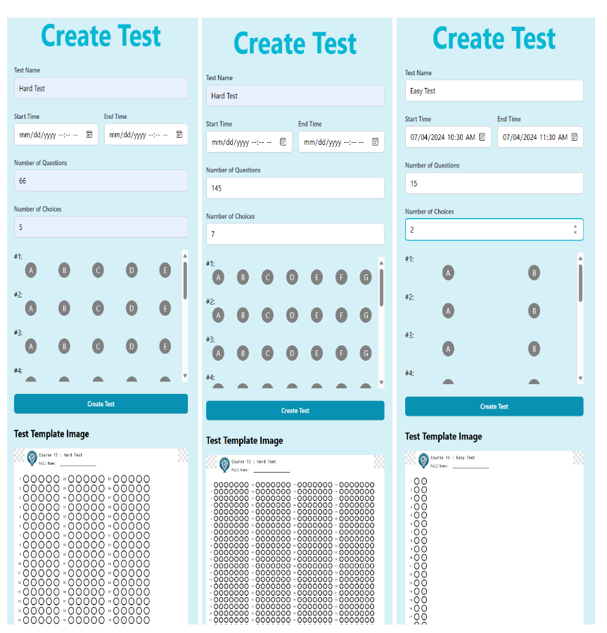
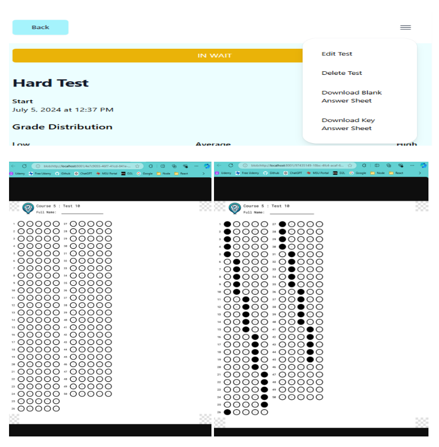
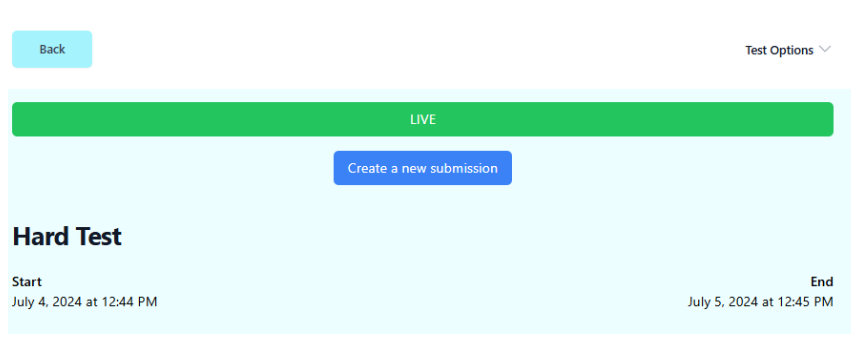
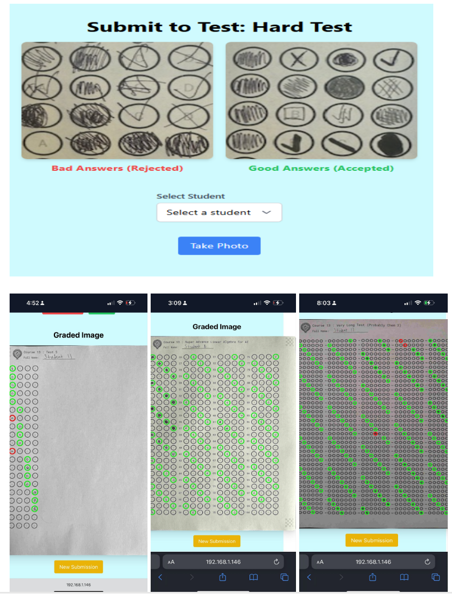

# LiveTest - open-source, server-based, OMR testing software. 

  ### Create your school's custom answer sheets and grade them in the browser!

  free, easy, consistent process for server based dynamic OMR grading/scanning using highly customizable answer sheets that can be integrated with any school. 

  This repo is the result of the research conducted by Garrett Mathers and Professor Terry Griffin  to deliver a free and highly configurable answer sheet generation tool that could be graded using low quality cameras accurately and consistently.  

  My research is attached as a .pdf so feel free to read the purpose of LiveTest and the walkthrough of the OMRGrader and answer sheet creation module "Pictron"

# Fair warning: this repo is large! I have a lot of examples.

# /backend
### /answer_sheets  - research
  - main.py --> customizable, dynamically gradable test answer sheets
  - grader.py --> dynamic OMRGrader module that grades answer_sheets produced by main.py

### app.py   
  - builds and orchestrates the backend fastapi/sqlalchemy application

        
# /frontend 
  implements the demo app built using Vite React JavaScript to showcase the abilities of the backend. 

# /deploy
The whole app can be built and run using docker in two commands. see the README.md in deploy for more info. 

  Here is some example answer sheets and a showcase of the OMR scanner, as well as examples of the frontend 

