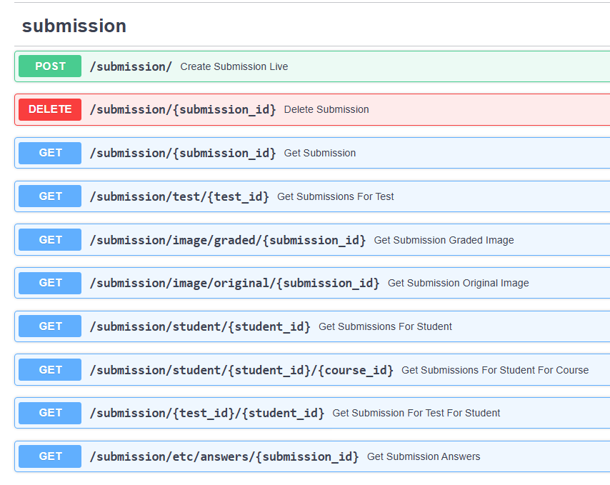

# backend
 - the core of the research. 
 - Take a look at answer_sheets. 

  - /answer_sheets  highly customizable answer sheets with a dynamic OMR grader
  - app.py   builds the database and runs the LiveTest fastapi server. 


### get to development / try out the app!
  1. confirm presence of python on system using python --version
  ```$ python --version ```
  ```Python 3.12.10```
  if you don't have Python, you're going to need it... Or use Docker found in /deploy
  
  2. Build a virtual environment, source it, install dependencies.
     ```python -m venv venv```
     ```source venv/bin/activate```
     ```pip install -r requirements.txt```
  
  3. Run the fastapi app
    ```python app.py```

  4. Get some fake data in there with 
      ```testing/db_startup_sim.py``` -- this script is very helpful for creating demo environments in LiveTest quickly.

    available constants for fake data creation
    SEMESTER = "Fall"
    SCHOOL_DOMAIN = "my.msutexas.edu"
    NUM_STUDENTS = 20
    NUM_TEACHERS = 4
    NUM_COURSES = 15
    COURSES_PER_STUDENT = 5
    subjects = ["MATH", "CMPS", "ENGL", "HIST", "CH", "SHOP", "TECH"]


### .env configurable constants 
I left the .env file in here for reference --> changed all my passwords.
The docker stuff works off of it 

### documentation
  go to 'http://localhost:8000/docs' once you have the fastapi app running with some fake data for more info on the various functionality that the API implements. Here is a preview




## app.py
  builds the fastapi application

## old_test/ 
  The original testing and research that took place to allow for the production of /answer_sheets

## models/
  pydantic models that handle data verification through the fastapi routers

## routers/
  fastapi routers that implement the various HTTP routes of the backend. 

## db.py 
  handles creation of database tables and the db session maker. 

## tables.py 
  SQLAlchemy models defined for database definition and relationships. 

## jwt.py
  implements the security features of the app. 

## env.py
  grabs the instance details from the .env file and builds the db connection string

## .env 
  instance configuration file
